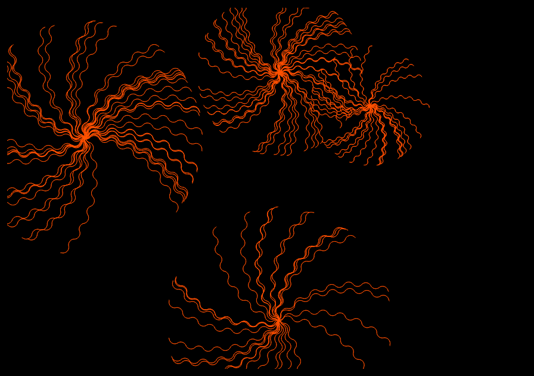
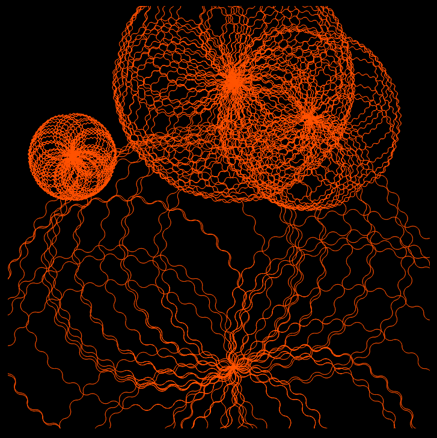

# Flowers

This is a graphics of flowers formed from the lines, appearing on the screen.

Live version https://ksenia007.github.io/flowers/

Some examples of the resulting graphics:

  
    

**Features:**

- Uses Objects and Classes to make the control and data management easier

- Random size of the flower on the reshresh

- Adaptive screen size (changes depending on the user's device)

- Capability to add objects of random size when clicked (works on the computer only)

